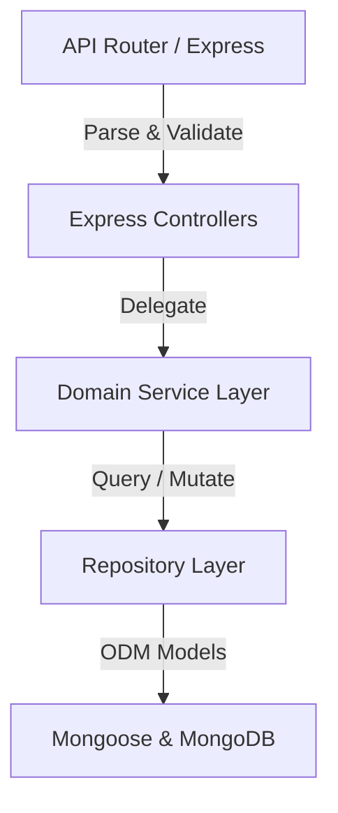

# WorkSphere Architecture & System Design Document

This document outlines the core architecture, data flow, tenant isolation patterns, and AI integration mechanisms of the WorkSphere SaaS platform.

---

## 1. Architectural Style: Clean Architecture & SOLID

WorkSphere separates layers to isolate database technology from business logic:

- **Express Routers**: Serves as entry points. Parameters are validated via Zod schemas before being delegated.
- **Controllers**: Thin request handlers. They extract request parameters, user auth context, and pass them to Services.
- **Service Layer**: Houses the core domain logic (e.g., computing gross earnings, taxes, deductions, leave deductions, and AI assistant query routing).
- **Repository Layer**: Encapsulates all Mongoose query methods, isolating the database model details from the rest of the application.

---

## 2. Multi-Tenant Data Isolation

Data separation is enforced at the database layer using a custom Mongoose plugin (`tenantPlugin.ts`):

- **Auto-Injection**: A `pre('validate')` hook automatically extracts the current tenant `companyId` from the active request context (using Node's `AsyncLocalStorage` via the `tenant.middleware`) and populates it.
- **Automatic Query Filtering**: A query middleware hook intercepts all `find`, `findOne`, `update`, and `count` operations, appending `{ companyId }` to the filter criteria.
- **Access Control**: Users are strictly barred from querying documents belonging to other company ids.

---

## 3. Real-Time Gateway & Notification Flow

Real-time notifications are powered by Socket.IO:

1. **Client Handshake**: When the client loads, a socket connection is opened to the backend server.
2. **User Registration**: The client emits a `register_user` event passing their authenticated `userId`.
3. **Session Registration**: The gateway maps the socket session to the active `userId`.
4. **Push Flow**: When backend events occur (e.g. Leave Approved, Expense Submitted, Salary Processed), the system calls `notificationRepository.create` and uses the gateway mapping to emit a real-time event directly to the active socket session.

---

## 4. AI Chat Assistant Integration

The AI Chat Assistant leverages OpenAI GPT with custom search fallback helpers:

- **Context Integration**: The assistant query route receives the tenant ID.
- **Knowledge Base Retrieval**: Custom lookup services query the active tenant's databases for leaves, holidays, active employees, and department salaries.
- **LLM Context Synthesis**: The database results are dynamically injected into the assistant's system prompt context.
- **Response Generation**: The LLM parses the question and outputs natural-language answers based on actual real-time database state.
