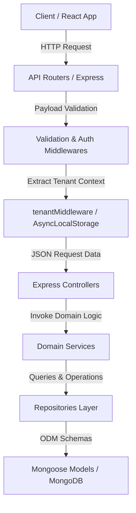
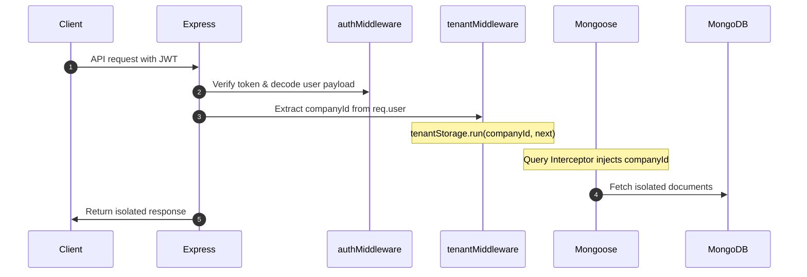
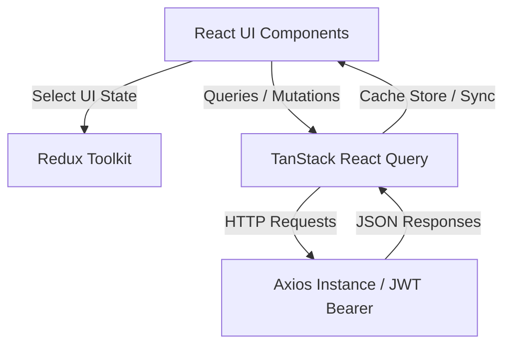
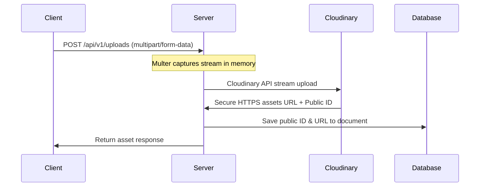

# Software Architecture

This document details the architectural style, design patterns, folder structure, and software engineering boundaries of the **WorkSphere** platform.

---

## 🏛️ 1. Architectural Style: Clean Architecture & SOLID Principles

WorkSphere is structured around **Clean Architecture** patterns, ensuring a decoupling of database technology, web servers, routing, and core domain business logic. This modular design adheres to SOLID principles to ease testability, expandability, and system maintainability.



### Architectural Layer Responsibilities

1. **Routing Layer (`src/routes/` & `src/features/auth/routes/`)**:
   - Acts as the HTTP entry point. Maps REST paths to appropriate controller methods.
   - Enforces preliminary route rules like CORS, rate-limiting, and validation schemas.

2. **Controller Layer (`src/controllers/` & `src/features/auth/controllers/`)**:
   - Serves as the HTTP translation boundary.
   - **Inputs**: Extracts body, params, headers, and query strings. Retrieve user context from `req.user`.
   - **Process**: Delegates business execution immediately to the Service Layer.
   - **Outputs**: Wraps return values into standardized HTTP status codes and responses via `ApiResponse` or routes exceptions to the Express error boundary.

3. **Service Layer (`src/services/` & `src/features/auth/services/`)**:
   - The core brains of the system. Completely decoupled from Express `req` and `res` objects.
   - Orchestrates transactions, executes calculations (gross pay computation, leave deductions, shift time validations), triggers external calls (Cloudinary upload, SMTP mailer), and validates business rules.

4. **Repository Layer (`src/repositories/`)**:
   - Implements the Repository Pattern, abstracting all database-specific query logic away from the service layer.
   - Performs Mongoose collection lookups, population rules, filters, and projections.

5. **Database Models Layer (`src/models/`)**:
   - Defines Mongoose Schemas, validators, hooks, and static helpers.
   - Applies core runtime plugins like soft deletion (`softDeletePlugin`) and multi-tenant scoping (`tenantPlugin`).

---

## 🔒 2. Multi-Tenant Architecture & Scoping

WorkSphere isolates organization-specific workspaces using a **shared database, scoped documents** model. This is enforced transparently without manual query injection in the controllers or services.

### Context Propagation via AsyncLocalStorage

Node's `AsyncLocalStorage` is utilized to share the active tenant's context safely across asynchronous call stacks:



1. **`tenantMiddleware.ts`**:
   - The token verification step places `companyId` inside `req.user`.
   - The `tenantMiddleware` checks for `req.user.companyId` and runs the next middleware step within the context of `tenantStorage` (an instance of `AsyncLocalStorage`).

2. **`tenantPlugin.ts` (Mongoose Schema Interceptor)**:
   - A schema validator hook checks the storage context and automatically sets `companyId` on new document creation.
   - A query hook intercepts `find`, `findOne`, `findOneAndUpdate`, `countDocuments`, and `aggregate`, dynamically injecting the current company ID:
     ```ts
     const companyId = tenantStorage.getStore();
     if (companyId) {
       this.where({ companyId });
     }
     ```

---

## 🔄 3. Request Lifecycle & Middleware Pipelines

Every HTTP request traverses a well-defined pipeline before execution:

```
[Request]
   │
   ▼
[Helmet (Headers Protection)]
   │
   ▼
[CORS (Origin Verification)]
   │
   ▼
[Rate Limiting (Protection vs. DoS)]
   │
   ▼
[JSON / Cookie Parsers]
   │
   ▼
[authenticateUser (JWT Verification)]
   │
   ▼
[tenantMiddleware (Tenant Storage Context)]
   │
   ▼
[requirePermissions (RBAC Gate)]
   │
   ▼
[Zod Validator (Schema Enforcement)]
   │
   ▼
[Controller Handler]
   │
   ▼
[Error Handler (Global Catch Exception)] ── (On Failure) ──► HTTP Error Response
```

---

## 📦 4. Frontend Application Architecture

The client React app runs on **Vite** and uses a modular feature-sliced layout. It manages state across three distinct domains:

### State Management & Caching Strategy



1. **Server State (TanStack Query v5)**:
   - Handles all network queries and caching.
   - Ensures stale-while-revalidate fetching, window re-focus synchronization, and optimistic UI updates for leave requests and attendance logging.
   - Replaces manual `useEffect` fetching blocks.

2. **Global Client State (Redux Toolkit)**:
   - Reserved strictly for authentication session tokens, notifications drawer lists, and global workspace theme/sidebar states.

3. **Form State (React Hook Form + Zod)**:
   - Form inputs are validated locally inside the browser using Zod schemas matching the backend validations, preventing unnecessary API round-trips.

---

## 🖼️ 5. Media & Upload Architecture

All file uploads (company logos, employee contract attachments, reimbursement receipts) follow a secure, managed pipeline:



1. **Multer Middleware**: Captures file streams from incoming multi-part requests and stores them temporarily in memory.
2. **Cloudinary Service**: Stream-uploads raw file buffers to Cloudinary using secure API keys.
3. **Mongoose Hook**: Stores the absolute HTTPS asset URL and the Cloudinary `public_id` in the DB. The `public_id` is essential for deleting or replacing the asset.

---

## 📧 6. Email Delivery Pipeline

System alerts and notifications (SSO verification links, password resets, monthly payslip PDFs) are delivered asynchronously:

1. **Email Service (`src/services/email/email.service.ts`)**:
   - Formats rich HTML templates using CSS inline layout blocks.
   - Signs attachments (such as PDF salary slips).
2. **Nodemailer SMTP Transporter**:
   - Authenticates against secure credentials (configured via Mailtrap in development and Gmail SMTP/SendGrid in production).
   - Operates in a fire-and-forget promise block to avoid slowing down the user's HTTP request lifecycle.
