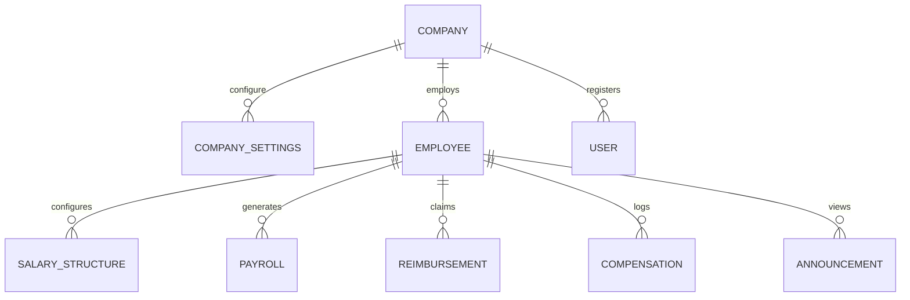

# WorkSphere Database Schema & Collections Design

This document details the MongoDB collections, indexes, and entity relationships implemented in the WorkSphere HRMS database.

---

## 1. Entity Relationships Model

---

## 2. Core Collections Schemas

### 1. `companies`
Represents the tenant space.
- `_id`: ObjectId
- `name`: String (Required)
- `slug`: String (Unique, Indexed)
- `email`: String (Required, Unique)
- `status`: String ('Active' | 'Suspended')

### 2. `companysettings`
Configuration overrides per company.
- `_id`: ObjectId
- `companyId`: ObjectId (Ref: Company, Indexed)
- `currency`: String (Default: 'USD')
- `timezone`: String (Default: 'UTC')
- `weekendDays`: Array of Numbers (0 = Sunday, 6 = Saturday)
- `officeHours`: Object { start: String, end: String }

### 3. `employees`
Contains profile details.
- `_id`: ObjectId
- `userId`: ObjectId (Ref: User, Unique)
- `employeeId`: String (Unique)
- `companyId`: ObjectId (Ref: Company, Indexed)
- `firstName` & `lastName`: String
- `phone`: String
- `status`: String ('Active' | 'Inactive')

### 4. `salarystructures`
Base configuration templates for earnings & deductions.
- `_id`: ObjectId
- `employeeId`: ObjectId (Ref: Employee, Indexed)
- `companyId`: ObjectId (Ref: Company)
- `basicSalary`: Number
- `hra`: Number
- `specialAllowance` / `conveyance` / `medicalAllowance`: Number
- `pf` / `esi` / `professionalTax` / `incomeTax`: Number
- `netSalary`: Number (Computed pre-save)

### 5. `payrolls`
Generated salary cycles.
- `_id`: ObjectId
- `employeeId`: ObjectId (Ref: Employee, Indexed)
- `companyId`: ObjectId (Ref: Company, Indexed)
- `month`: String (Format: 'YYYY-MM', Indexed)
- `basicSalary`: Number
- `totalEarnings`: Number
- `totalDeductions`: Number
- `netSalary`: Number
- `status`: String ('Draft' | 'Locked')

### 6. `reimbursements`
Expense claims.
- `_id`: ObjectId
- `employeeId`: ObjectId (Ref: Employee, Indexed)
- `companyId`: ObjectId (Ref: Company)
- `title`: String
- `amount`: Number
- `category`: String ('Travel' | 'Food' | 'Internet' | 'Medical' | 'Other')
- `expenseDate`: Date
- `status`: String ('Pending' | 'Approved' | 'Rejected' | 'Paid')

---

## 3. Database Indexes Strategy

To guarantee rapid query performance under enterprise SaaS loads, the following indexes are declared:

1. **`companies`**: Compound index `{ slug: 1 }` to resolve vanity subdomains.
2. **`payrolls`**: Compound index `{ companyId: 1, month: 1 }` to fetch monthly cycle grids efficiently.
3. **`employees`**: Compound index `{ companyId: 1, employeeId: 1 }` for individual worker lookups.
4. **`reimbursements`**: Compound index `{ companyId: 1, status: 1 }` to list claims queue reviews.
