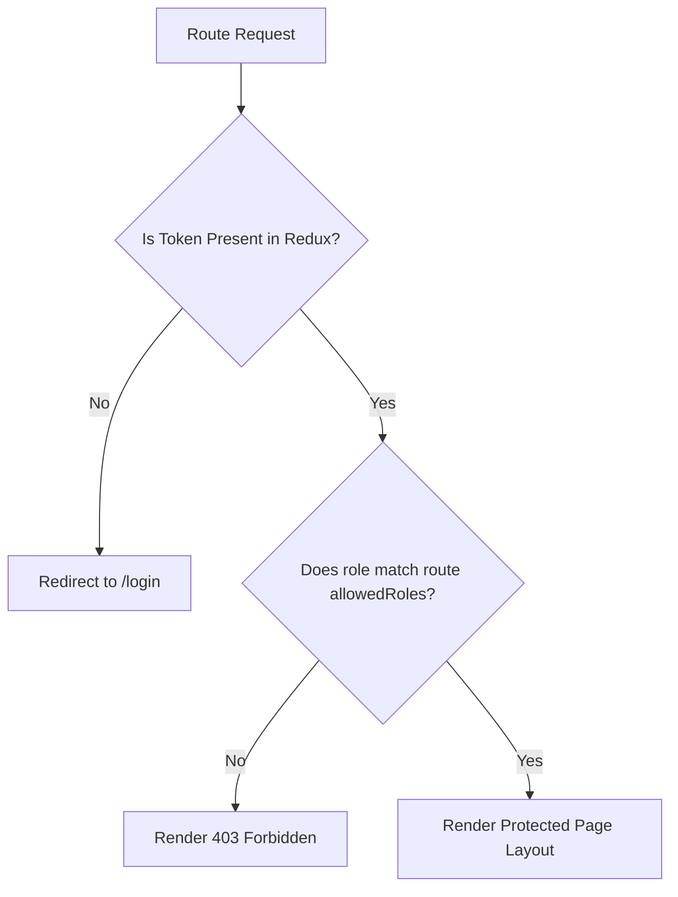

# Frontend Engineering Guide

This document details the React, TypeScript, and state management architectures implemented in the **WorkSphere** client application.

---

## 🏗️ 1. React & TypeScript Application Structure

The frontend is built using React 18, Vite, and TypeScript, organized into a feature-sliced directory structure. This isolates specific feature modules (like `auth`, `payroll`, `leaves`, `reimbursements`) into independent directories containing their own API calls, custom hooks, pages, components, and schemas.

```
client/src/
├── components/          # Reusable shared UI elements (Button, Input, Card)
├── features/            # Isolated domain feature slices
│   ├── auth/
│   │   ├── api/         # Axios network request calls
│   │   ├── components/  # Presentation forms (LoginForm, RegisterForm)
│   │   ├── hooks/       # Custom React hooks containing operational logic
│   │   ├── pages/       # Router entry pages (LoginPage, RegisterPage)
│   │   └── schemas/     # Zod payload validation schemas
│   ├── leaves/
│   └── payroll/
├── layouts/             # Shared shell views (DashboardLayout, AuthLayout)
├── redux/               # Global Redux slices and store configuration
└── services/            # Axios network instances and configurations
```

---

## 🎛️ 2. State Domains Design

To prevent component bloat and unnecessary re-renders, the frontend divides state into three distinct scopes:

```
                  ┌──────────────────────┐
                  │   State Management   │
                  └──────────┬───────────┘
                             │
       ┌─────────────────────┼─────────────────────┐
       ▼                     ▼                     ▼
[Local / Form State]  [Global UI State]     [Server State Cache]
- React Hook Form     - Redux Toolkit       - TanStack React Query
- Zod Schemas         - Auth JWT Token      - Network Data (Leaves,
- Inputs, toggles     - Sidebar Toggle        Employees, Payroll)
                      - Notification Bell   - Automatic Sync / Retry
```

### 1. Server State (TanStack React Query v5)
- All remote API resources (employees ledger, payslips, leaves tracker) are managed by TanStack Query.
- **Why?** It replaces manual fetching code with automatic caching, request deduplication, background updates, and optimistic UI transitions.
- **Example Usage (`useLeaves.ts`)**:
  ```ts
  export const useLeavesQuery = () => {
    return useQuery({
      queryKey: ['leaves'],
      queryFn: async () => {
        const res = await axiosInstance.get('/leaves');
        return res.data.data;
      },
      staleTime: 5 * 60 * 1000, // Keep data fresh in cache for 5 minutes
    });
  };
  ```

### 2. Global Client State (Redux Toolkit)
- Reserved for client-side state, such as active user session data, the authentication token, and global UI flags (e.g., sidebar toggles, theme settings).
- Synchronizes the access token to memory and persists session state across page reloads.

### 3. Local / Form State (React Hook Form + Zod)
- Handles user input form states locally. Form schemas validate input parameters in the browser before sending requests to the backend.

---

## 🔒 3. Routing & Security

The routing layer is powered by **React Router v6**, which separates public entry routes from protected workspace modules.



### Route Gate Guards (`ProtectedRoute.tsx`)
```tsx
import { Navigate, Outlet } from 'react-router-dom';
import { useAppSelector } from '../redux/hooks';

interface ProtectedRouteProps {
  allowedRoles?: string[];
}

export const ProtectedRoute: React.FC<ProtectedRouteProps> = ({ allowedRoles }) => {
  const { token, user } = useAppSelector((state) => state.auth);

  if (!token) {
    return <Navigate to="/login" replace />;
  }

  if (allowedRoles && user && !allowedRoles.includes(user.role)) {
    return <Navigate to="/unauthorized" replace />;
  }

  return <Outlet />;
};
```

---

## ⚡ 4. Frontend Performance Optimizations

To keep the application highly responsive and minimize initial load times, the client implements the following optimizations:

1. **Route-Level Code Splitting (Lazy Loading)**:
   - Heavy dashboard screens and modules (like payroll spreadsheets and settings panels) are loaded dynamically using `React.lazy` and `React.Suspense`. This breaks the bundle down into smaller chunks, loading them only when a user navigates to those sections.
   - **Implementation**:
     ```tsx
     const PayrollDashboard = React.lazy(() => import('./features/payroll/pages/Dashboard'));
     ```

2. **Network Request Deduplication**:
   - Axios interceptors match identical pending requests, resolving them to a single network call to prevent duplicate backend queries.

3. **Optimistic UI Updates**:
   - For simple actions like marking a notification as read or submitting an expense, TanStack Query temporarily updates the UI state immediately, rolling back changes if the backend request eventually fails.
