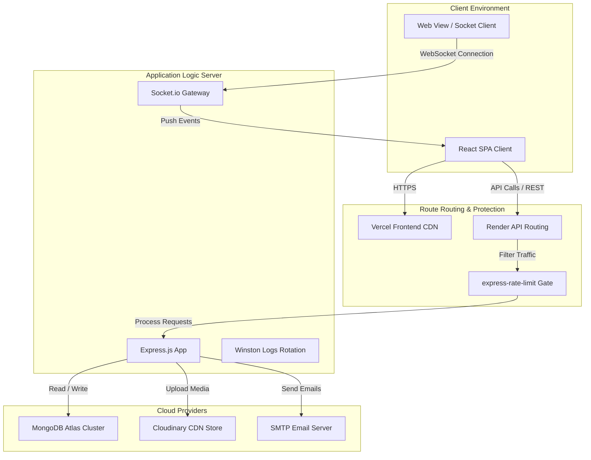
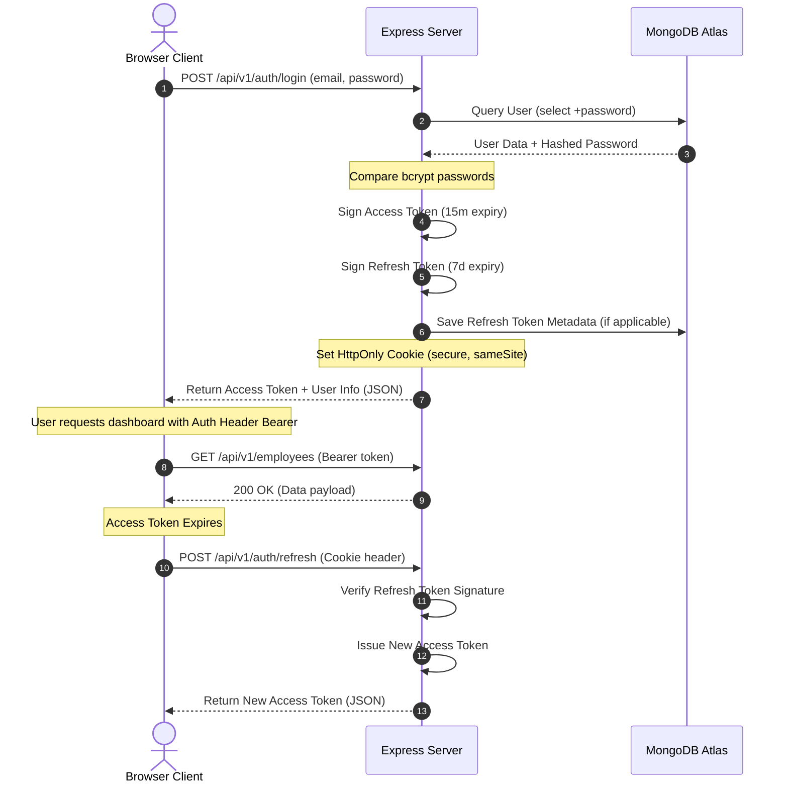
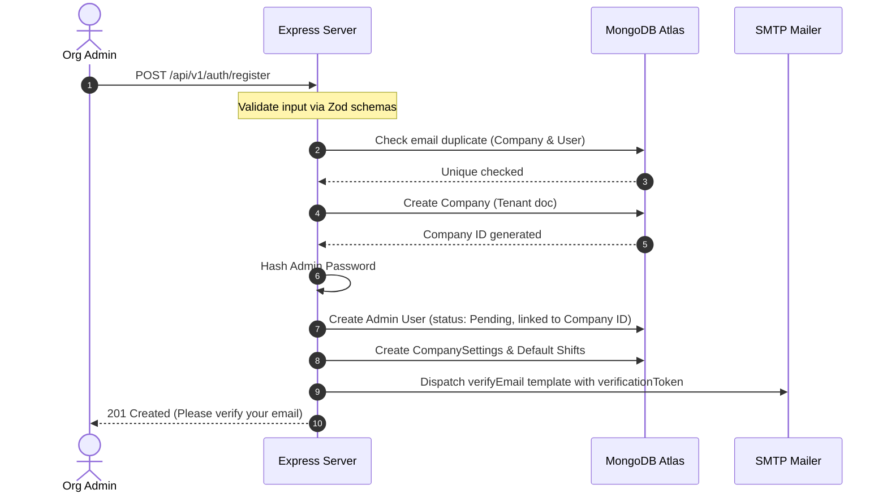
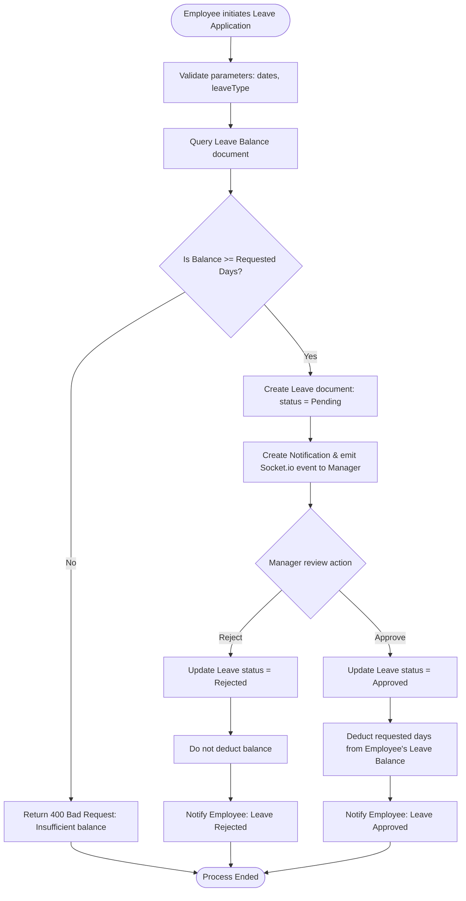
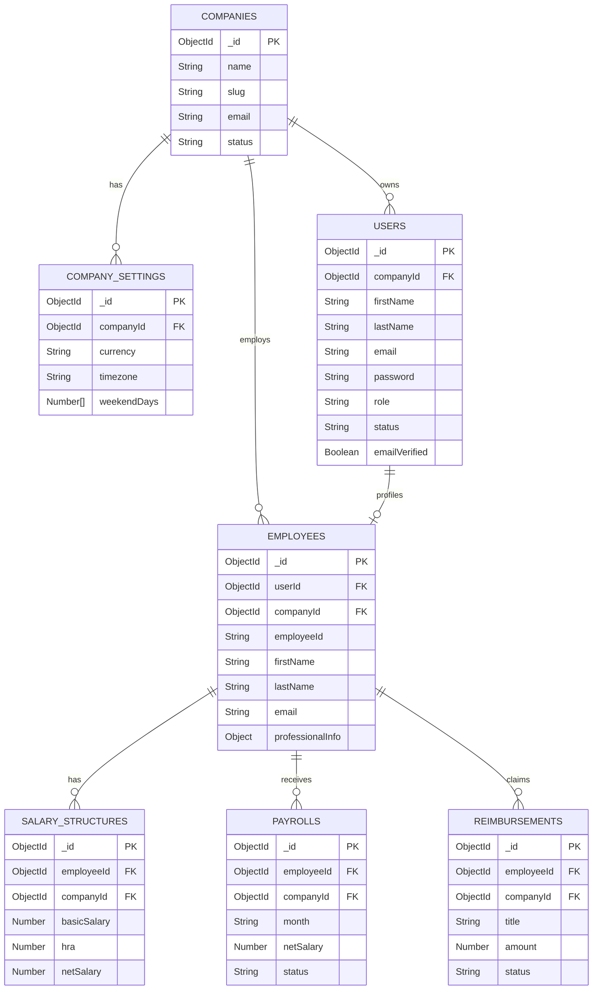

# System Design & Diagrams

This document contains high-level and low-level system designs, database representations, sequence flows, and request lifecycle architectures for **WorkSphere**.

---

## 🗺️ 1. High-Level Architecture

The platform separates client requests, application processing layers, secure external storage, database storage, and notification channels:



---

## 🔑 2. Authentication & JWT Token Lifecycle

WorkSphere implements **Refresh Token Rotation (RTR)** to protect session security. Access tokens are transient, while refresh tokens are stored securely in HttpOnly cookies.



---

## 🏢 3. Organization Provisioning Flow

Organizations provision isolated spaces automatically upon registration:



---

## 📊 4. Leave Application & Approval Flow

Leave requests are tracked dynamically. Validation rules verify employee balances before routing decisions:



---

## 🗄️ 5. Database Schema Relationships

The MERN database uses a referenced document design. Scoping to the parent organization is enforced by `companyId`:



---

## 🔄 6. Request & Response Lifecycle

The flow diagram below details the boundary states a client request undergoes, mapping the frontend Axios lifecycle to backend processing and error traps:

```
[Browser Action]
   │
   ▼
[Axios Interceptor] (Attach JWT Bearer token)
   │
   ▼
[Network Transport]
   │
   ▼
[Express Server] ──► [CORS & Rate Limiter validation]
                         │ (If fails)
                         ├─────────────────────────────► [429 / 403 Response]
                         │ (If passes)
                         ▼
                     [Auth Middleware Verification]
                         │ (If token expired)
                         ├─────────────────────────────► [401 Unauthorized]
                         │ (If valid)
                         ▼
                     [tenantMiddleware injection]
                     (Set AsyncLocalStorage tenant context)
                         │
                         ▼
                     [Zod Schema Validator]
                         │ (If invalid payload)
                         ├─────────────────────────────► [400 Bad Request]
                         │ (If valid)
                         ▼
                     [Controller Layer]
                         │
                         ▼
                     [Service Layer] (Calculations, db transactions)
                         │
                         ▼
                     [Mongoose Query Interceptor] (Auto-inject companyId)
                         │
                         ▼
                     [MongoDB Atlas Store]
                         │
                         ▼
                     [ApiResponse Formatter] (200 / 201 JSON standard wrapper)
                         │
                         ▼
[Axios Success Interceptor] ──► [React Component State Update]
```
